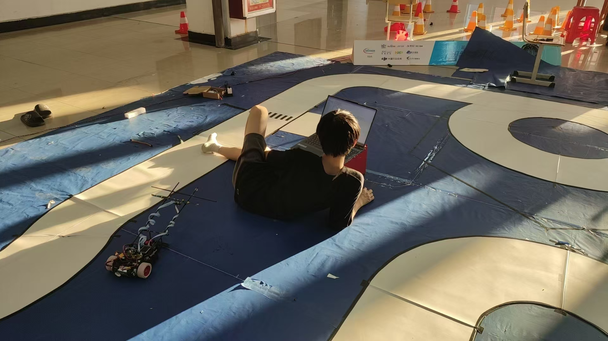
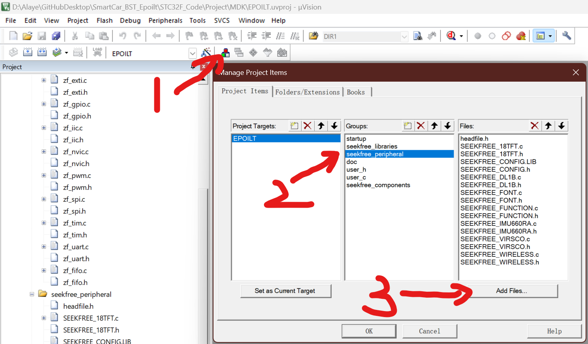
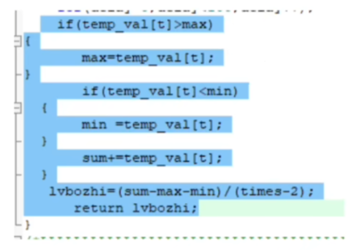
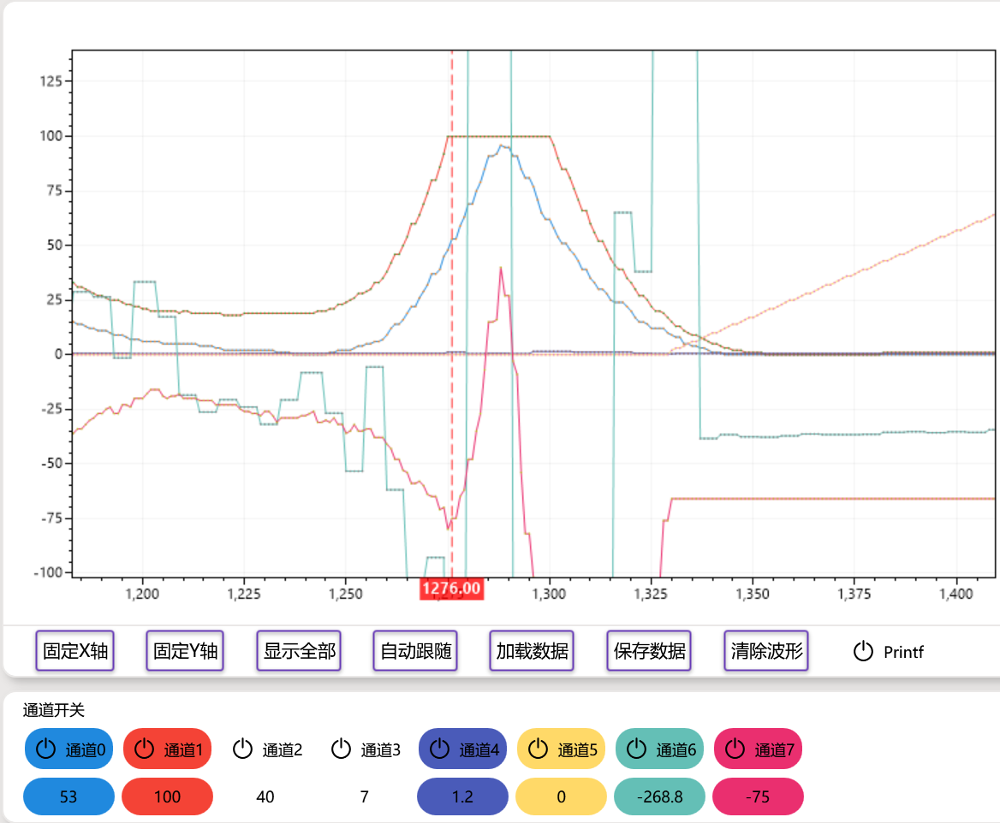
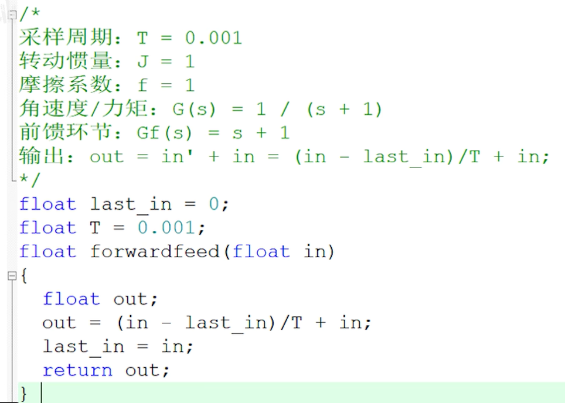
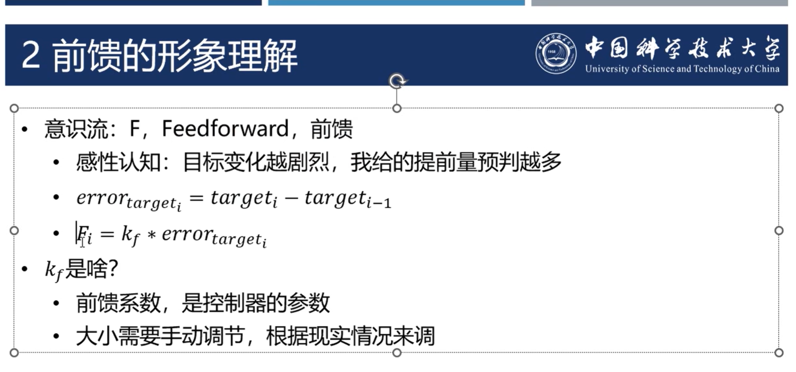

<p align="center">
  
</p>

<h1 align="center"> STC32F12K_BST_Epoilt </h1>
<p align="center">
  2024 年江西科技学院蓝色技术工作室智能车队 折线电磁组 BST-磁驭
</p>

## 写在最前

开源，希望可以给热爱智能车的各位提供一些参考和帮助。水平有限，可能存在一些错误，需要注意。准备智能车很花时间和经历，白天在实验室调车，必须回寝室了就继续研究代码到半夜，在这过程中也让我学到了很多，也有很多遗憾，这恰印证了那句圈内话————“遗憾才是智能车最大的魅力。”




## 致谢

在准备智能车的过程中，受到了许多人的支持与帮助，在此致谢：

- 感谢 Jia Huanyu[@Averyjhy](https://github.com/Averyjhy) 的陪同与后勤，在赛道上和我一起研究参数、发车、抓车，在我投入调车忘我的时候为我带来好吃的和饮料，在我对着代码研究到深夜时提醒我不要熬夜，在我焦虑时和我聊天散心，给予了我鼓舞。
- 感谢 Peng Qiang 学长的理论指导和主板设计，虽然主板最后没能上在正式比赛用上，但你以往的指导见解对于项目探索具有重要的意义。
- 感谢 Huang Junwei 在电路设计及焊接上的帮助。
- 感谢 Huang Jiawen, Huang Xu, Feng Peiru, Xiao Xun, Liu Xuan, Wang Jianyong，让我的调车日常中多了些欢声笑语和互帮互助，
- 感谢以上的我们，我们共同组成了蓝色技术工作室 2024 智能车队，这段历程无比难忘。希望大家未来无限进步！

## 注意

### 编码格式或中文乱码

Keil 原因，使用中文注释必须使用 GB2312 编码，所以当查看本项目代码出现乱码时，请尝试将编码方式调整为 GB2312

### INTERRUPT(x) interrupt x

> [!WARNING]
> **如果想移植代码，请注意根据情况将 `INTERRUPT(x)` 改回 `interrupt x`**

本项目使用到了 `Keil uVision Assistant` 插件进行开发，但是 C251 项目中 `isr.c` 中的 `interrupt x`（x 代表一个数字）会导致 VSCode 语法分析做出不应该有的报错，所以通过宏定义进行修复，具体请参照 [关于 C51/C251 的中断提示问题](https://github.com/jacksonjim/keil-assistant/blob/master/README.md)。本项目已经将所有 `interrupt x` 改为了 `INTERRUPT(x)` 并在公共头文件中加入了用于修复的宏定义。

### 无用设备驱动文件

为节省单片机存储空间，没有使用到的设备驱动文件已经从 Keil 项目中移出，保存在 `STC32F_Code\Libraries\seekfree_peripheral\Unuse`文件夹中。
若需要重新添加，请在 Keil 的 Manage Project Items 中将需要的文件重新添加到项目中。



### 符号链接

本项目使用到了 `Keil uVision Assistant` 插件进行开发，但如果 `.uvprj `文件不在打开的一级子文件夹中，插件将无法自动识别到 `.uvprj `文件，每次都需要手动指定，进行重复的操作。所以可以使用 [希望打开 vscode 时自动打开当前目录下所以子目录的 keil 工程文件 · Issue #39 · github0null/keil-assistant](https://github.com/github0null/keil-assistant/issues/39) 中提到的使用符号链接将深层子文件夹中 `STC32F_Code\Project\MDK\EPOILT.uvproj`文件链接到一级子文件夹中，生成的链接文件为 `SmartCar_BST_Epoilt\EPOILT.symlink.uvproj` ，生成的链接文件将同步目标文件的修改。

## 电感处理

此处介绍了一种快速计算处理电感处理方案
[智能车电磁寻迹相关知识讲解](https://www.bilibili.com/video/BV1Ki4y127kK/?share_source=copy_web&vd_source=b91af0127331bb4444b9388984a23393&t=553)



### 直角时竖直电感饱和带来的影响



图示，为正在进行右直角转弯时的上位机值，观测的数据通道 1、2 为左、右竖直电感的值，通道 7 为差比和差加权算法的偏差计算结果。可见右直角时竖直电感会增大，偏差也会随直增大，但是若竖直电感出现饱和，偏差值将会错误的变小（竖虚线位置）。

```c
// * 差比和差加权算法  
temp_difference = H_GAIN * (inductor[LEFT_H] - inductor[RIGHT_H]) + V_GAIN * (inductor[LEFT_V] - inductor[RIGHT_V]);
temp_sum_difference_weighted = H_GAIN * (inductor[LEFT_H] + inductor[RIGHT_H]) + abs((inductor[LEFT_V] - inductor[RIGHT_V]));
position_difference_weighted = (temp_difference * 100) / (temp_sum_difference_weighted + 1);
```

其原因是因为右竖直电感达到饱和时，左竖直点感仍在增加。即 `inductor[LEFT_V]-inductor[RIGHT_V]`变小了，所以依据差比和差加权算法，其偏差值会变小甚至会出现错误的偏差值指向另外一个方向的情况。
为了避免这种影响，应该调整归一化使得电感不饱和，即让竖直电感最大时恰好为 100 或逼近 100，但不是提前饱和。或者也可以在右电感过饱和的起始处保持 `inductor[LEFT_V]-inductor[RIGHT_V]`的值，降低这种情况的影响（这种方法待验证）。

## 增量式 PI 的特殊意义与动态 P

增量式 PI 不能直接以“增大 P 响应快，增大 I 弥补误差”来理解。详情可以看一下这两篇博客。

> [增量式 PID 的 P 和 I 怎么理解（一）_i 增大动态性能-CSDN 博客](https://blog.csdn.net/fangchenglia/article/details/109518121)
>
> [增量式 PID 的 P 和 I 怎么理解（二）_pi 增大不是减少超调量吗？为什么会使超调量增加-CSDN 博客](https://blog.csdn.net/fangchenglia/article/details/109534127?spm=1001.2014.3001.5502)
>
> [增量式 PID 的 P 和 I 怎么理解（三）_增量 pid （三）-CSDN 博客](https://blog.csdn.net/fangchenglia/article/details/109550178?spm=1001.2014.3001.5502)

> 积分不能激活 P 的潜力，像增域为 200 的情况，需要选择小 P 去提高第一下的突增峰值，可以这么说，P 为 10 它的潜力已经被激活完了，就是 100 多这么大。我为什么说是 P=10 的潜力是 100 左右？P 系数所对应的潜力值怎么算？请根据我给的不等式（PWM 的限幅值>=增域×P 系数+初始 PWM 值，我这里暂且将这个不等式命名为 Bright 不等式）去算，计算方法：把初始 PWM 值默认为 0，用 PWM 的限幅值除以 P 系数即可得到 P 的潜力（此时 P 潜力的值=增域，但是 P 潜力不是增域，因为增域是给的，P 潜力是算出来的），999/10=99.9。想要曲线更完美跟上设定值 200，P 要改小。那么 P 给多少是最合适的？也请根据 Bright 不等式计算：现在的情况是初始 PWM 值等于轮子的当前速度等于 0，于是 999/200=4.995≈5，所以 P 给到 5。I 参数的给定没有公式，自己慢慢调，靠实际效果给。

PWM 的限幅值>=增域×P 系数+初始 PWM 值。

> 如果增量式 PID 是这样子的，我们要如何使用好它呢？
> 就一句话：P 需要多大要根据公式——PWM 限幅值==增域* P 系数+开电机时的初始 PWM 来定。

所以我们可以根据这个结论来求出电机增量式 P 的理论响应性最大值。

以下为代码 demo。但目前实际使用中效果并不理想，待深入研究。

```c
#include <stdio.h>

/* 计算 P 的最大值 */
double calculate_max_p(double pwm_limit, double increment, double initial_pwm) {
    if (increment == 0) {
        printf("增域 (increment) 不能为零。\n");
        return -1; /* 返回一个错误值 */
    }
  
    return (pwm_limit - initial_pwm) / increment;
}

int main() {
    double pwm_limit = 1000.0;  /* PWM 限幅值 */
    double increment = 5.0;     /* 增域 */
    double initial_pwm = 200.0; /* 开电机时的初始 PWM */
    double max_p;

    max_p = calculate_max_p(pwm_limit, increment, initial_pwm);
  
    if (max_p != -1) {
        printf("P 的最大值为：%f\n", max_p);
    }
  
    return 0;
}
```

## 位置式转向 PD

在简单的位置式 PD 控制中，P 项和 D 项的整定确实需要遵循一定的步骤和原则。

### 整定 P 项和 D 项的步骤

#### 整定 P 项

* **初始调整 P 项** ：首先调整 P 项，使其达到一个较大的值，直到系统开始出现抖动。这是因为 P 项（比例控制）主要用于减少误差，使系统快速响应目标位置。
* **观察系统行为** ：在调整 P 项的过程中，观察系统的响应速度和稳定性。过大的 P 项会导致系统抖动（震荡），而过小的 P 项会导致系统响应迟缓。

#### 整定 D 项

* **初始调整 D 项** ：在 P 项调整到使系统开始抖动后，开始调整 D 项。D 项（微分控制）主要用于抑制系统的抖动，减小超调量。
* **减小抖动** ：逐步增加 D 项的值，观察系统的抖动情况，直到抖动减小到一个可接受的范围。

### 调整原则

#### (1) 直道入弯过于延迟

* 直道入弯过于延迟通常是由于系统响应时间太长，这可能是 P 项设置不够大。如果系统已经振荡，那么增加 D 项可以帮助减小振荡，从而间接改善入弯延迟的问题。
* 更合理的解释是，如果系统响应速度慢，可以适当增加 P 项。如果系统在快速反应时抖动严重，则增加 D 项以减小抖动。

#### (2) 如果车辆在弯道中，轨迹过于外切，则需要加大 P 项

* **解释** ：在弯道中，如果车辆的轨迹过于外切，说明系统的跟踪误差较大。此时加大 P 项可以增加系统对误差的响应力度，使车辆更紧密地跟踪目标轨迹。
* **原理** ：P 项的增加会使系统对误差的响应更加迅速，从而减少跟踪误差，使车辆更紧密地沿着目标轨迹行驶。

### 实际应用中的注意事项

* **避免过调** ：在调整 P 项和 D 项时，需要避免过调。过大的 P 项会导致系统震荡，过大的 D 项会导致系统对噪声过于敏感。
* **联合调整** ：在实际应用中，P 项和 D 项的调整通常是联合进行的。可以先调整 P 项到一个合适的范围，然后逐步调整 D 项，反复迭代，直到系统达到最佳状态。

## 模糊 PID

[【智能车】模糊 PID 控制原理详解与代码实现-CSDN 博客](https://blog.csdn.net/weixin_45636061/article/details/124996230)

[飞思卡尔智能车----模糊 PID 算法通俗讲_汽车运动控制模糊 pid-CSDN 博客](https://blog.csdn.net/weixin_36340979/article/details/79168052)

[如何快速理解模糊 PID 算法 ---（一）_模糊 pid 控制算法-CSDN 博客](https://blog.csdn.net/m0_46451722/article/details/113765472)

[如何快速理解模糊 PID---（二）_模糊 pid 中的论域是什么-CSDN 博客](https://blog.csdn.net/m0_46451722/article/details/113769796?spm=1001.2014.3001.5502)

## 前馈控制




[【只用 PID? 加上前馈解决 95%的问题！】](https://www.bilibili.com/video/BV19T411t7du/?share_source=copy_web&vd_source=b91af0127331bb4444b9388984a23393&t=394)

[【硬核科普】PID 调参番外篇 feed-forward 前馈控制 让飞机预判你的预判 无人机穿越机玩家必看】](https://www.bilibili.com/video/BV1SP4y1p7Ht/?share_source=copy_web&vd_source=b91af0127331bb4444b9388984a23393&t=173)



## 参考资料

感谢提到的开源项目和博客教程提供的参考与帮助

### 开源项目

[第十六届智能车竞赛-国家级一等奖-嵌入式控制开源（恩智浦杯/飞思卡尔杯）-全国第 14 名 🏆](https://github.com/ittuann/Enterprise_E)

[第 16 届全国大学生智能车大赛-智能视觉组 上海交通大学 AuTop 战队 RT1064 主控代码](https://github.com/SJTU-AuTop/RT1064-Code)

### 博客教程

[智能车电感差比和差加权算法研究_差比和算法的原理-CSDN 博客](https://blog.csdn.net/zhuoqingjoking97298/article/details/108993827)

[基于简化 KNN 的模板匹配的智能车电磁元素识别算法_基于 knn 实现内容匹配-CSDN 博客](https://blog.csdn.net/qq_20545625/article/details/126010928)

[增量式 PID 的 P 和 I 怎么理解（一）_i 增大动态性能-CSDN 博客](https://blog.csdn.net/fangchenglia/article/details/109518121)

[增量式 PID 的 P 和 I 怎么理解（二）_pi 增大不是减少超调量吗？为什么会使超调量增加-CSDN 博客](https://blog.csdn.net/fangchenglia/article/details/109534127?spm=1001.2014.3001.5502)

[三轮控制之串级 pid（后续）——By 小学生_恩智浦（飞思卡尔）智能车竞赛_智能车制作 - Powered by Discuz! (znczz.com)](http://www.znczz.com/thread-282313-1-1.html)

[机器人差速轮运动学模型 (Differential Drive Kinematics) - 简书 (jianshu.com)](https://www.jianshu.com/p/5e512065e947)

### 论文期刊

[一种基于电磁传感器的智能车循线算法](https://www.c-s-a.org.cn/csa/article/pdf/20140320)

## TODO

* [X] 前馈 PID
* [ ] 卡尔曼滤波
* [X] 模糊 PID
